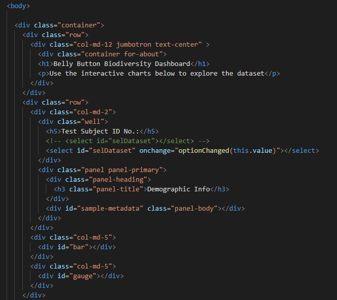
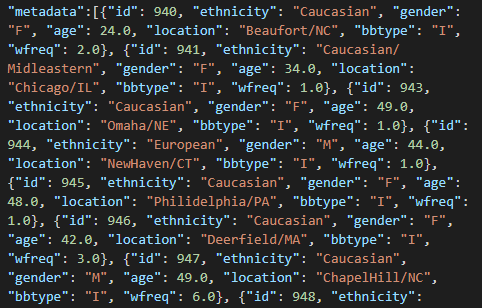
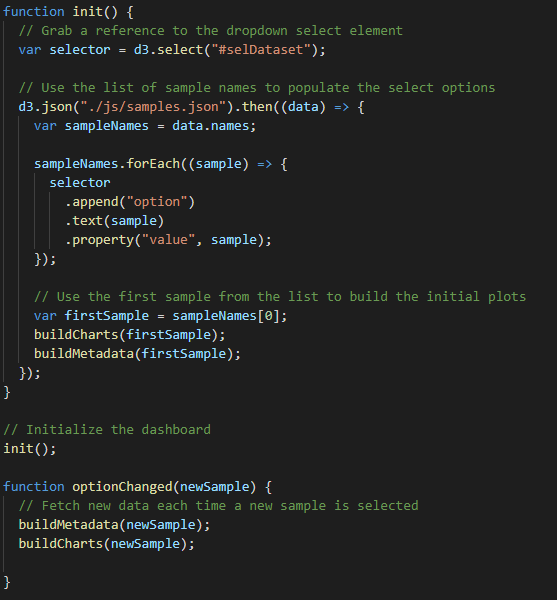
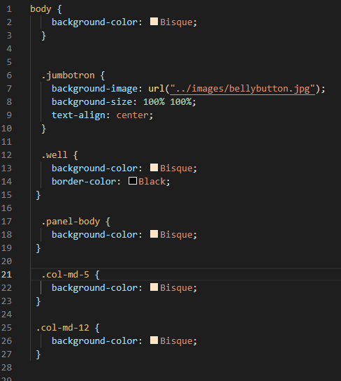

# Plotly - Belly Button Biodiversity
## Overview of the Project
An interactive website was created using a combination of html, JavaScript, and Bootstrap CSS stylizing.  Additionally, the Plotly library was accessed through a CDN and used to generate three different graphic visuals on the site: a bar chart, a gauge, and a bubble chart.  The point of the web site is to analyze the types of bacteria growing in different anonymous test subjects belly buttons.  The completed web site can be viewed at the link below.

[Belly Button Biodiversity Dashboard](https://eric-himburg.github.io/plotly/)

## Coding Examples
Within the HTML code for the web site, Bootstrap CSS was used to frame the page and organize the content.  A picture of the HTML code below shows the divisions grid system used.  Additionally, within this code can be found a portion of the JavaScript used to make the page dynamic.

Data from a JSON array is imported with the user selecting which individual's information would be displayed.  A sample of the imported data shown below.   

The data above was filtered and sorted using JavaScript.  Additionally, the data was sent to a Plotly library where select parts of the data were used to create a bar chart, a gauge and a bubble chart.  A sample of the JavaScript code used can be seen in the screenshot below.

## Enhancing the Website using Bootstrap
Bootstrap web frame-working was used to ensure the web site could be viewed from any device and was also used to make the content more readable.  Below is a screenshot of some the styling done to color the background, add a border color, and also add a picture.   

